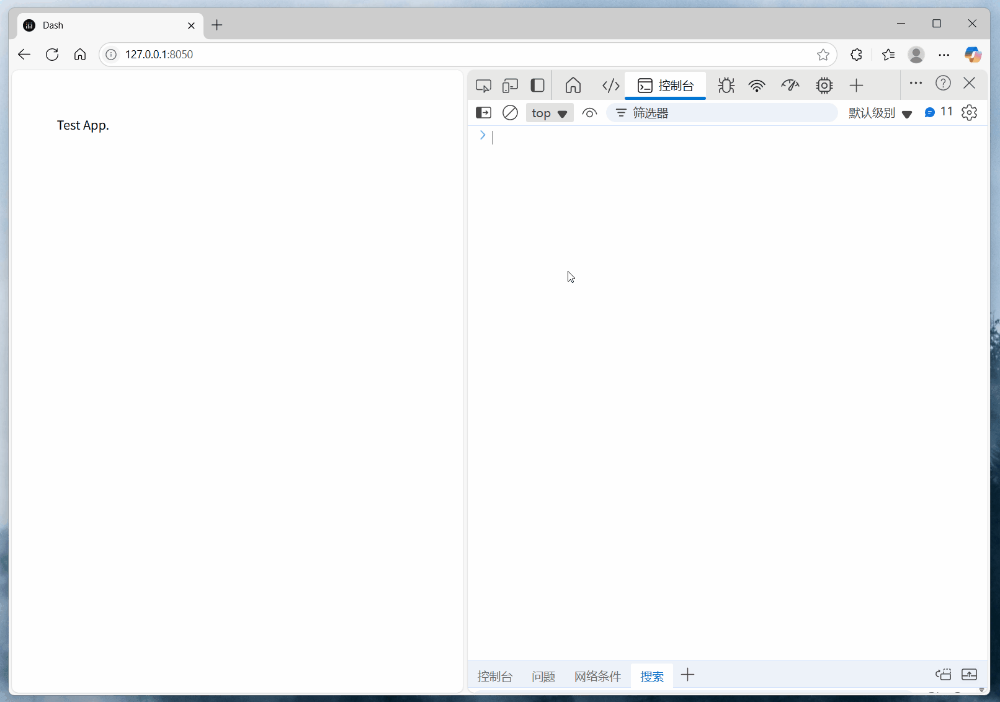

# dash-console-filter-plugin

[](https://github.com/CNFeffery/dash-console-filter-plugin/blob/main/LICENSE)
[](https://pypi.org/project/dash-console-filter-plugin/)
[](https://github.com/astral-sh/ruff)

简体中文 | [English](./README.md)

适用于[Dash](https://github.com/plotly/dash)应用的控制台消息过滤插件，基于`Dash Hooks`实现，用于过滤浏览器控制台中包含特定关键词的报错信息，以避免控制台中出现不必要的信息输出。

## 安装

```bash
pip install dash-console-filter-plugin
```

## 使用

```python
import dash

# 导入插件启用函数
from dash_console_filter_plugin import setup_console_filter_plugin

# 为当前应用启用插件
setup_console_filter_plugin(keywords=["test warning message"])

app = dash.Dash(__name__)

# 其他应用代码...
```

## 示例

执行示例应用：

```bash
python example.py
```

<center></center>

## 参数说明

### `setup_console_filter_plugin()`

用于为当前`Dash`应用启用控制台消息过滤功能。

| 参数       | 类型      | 默认值 | 描述                                                     |
| ---------- | --------- | ------ | -------------------------------------------------------- |
| `keywords` | List[str] | None   | 关键词列表，控制台中包含任何关键词的报错信息将不会输出。 |
